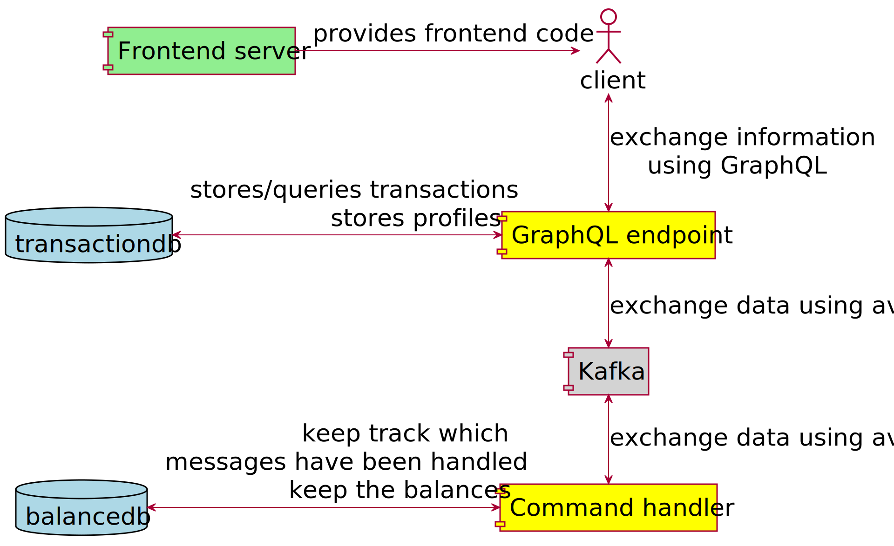
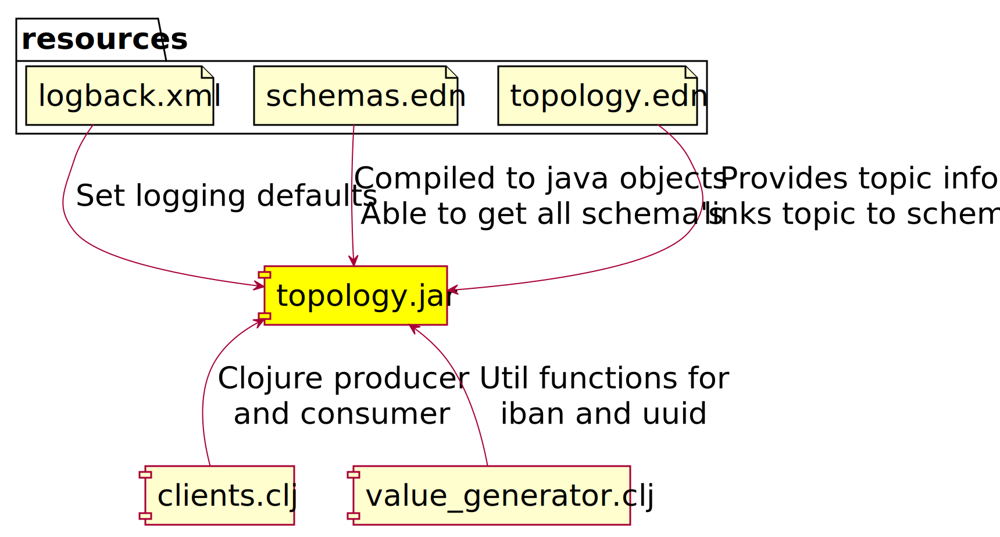
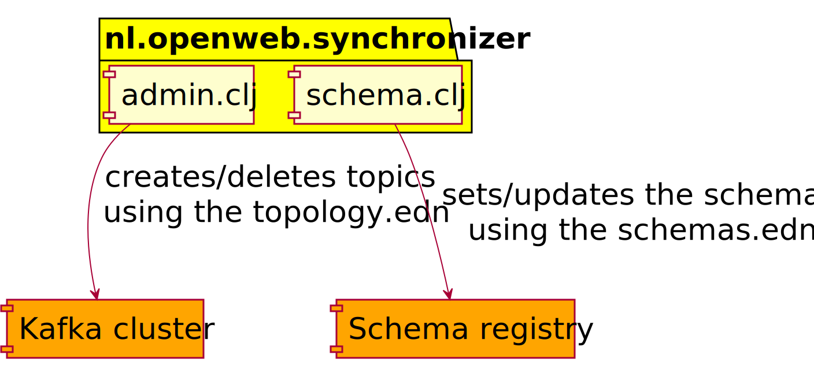
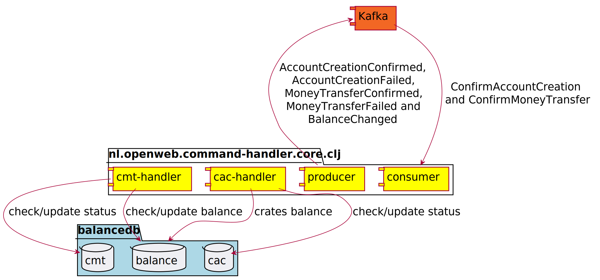
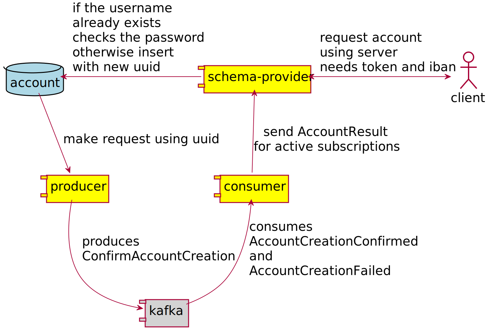
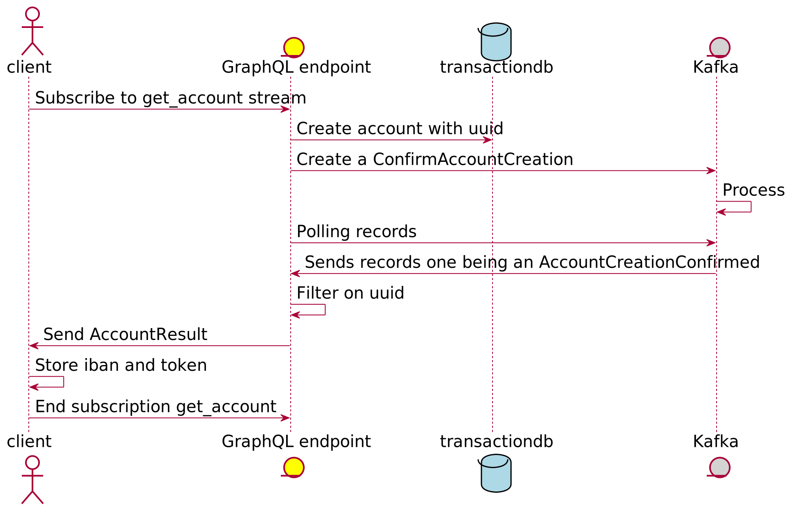
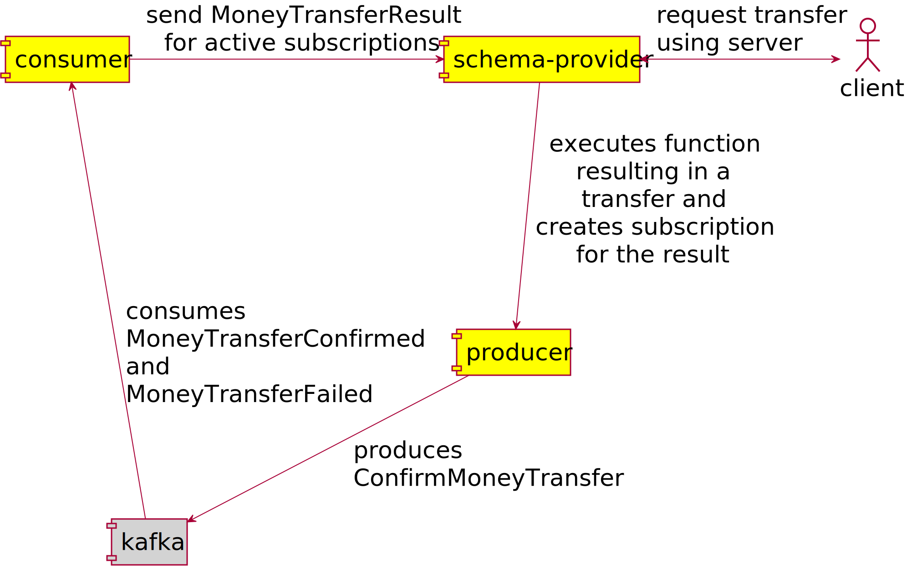
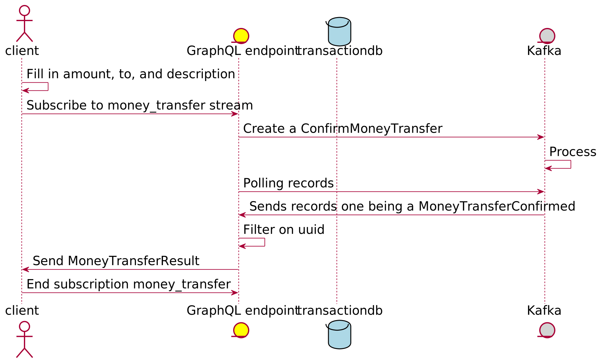
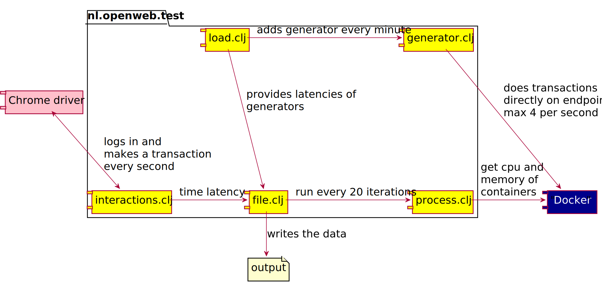
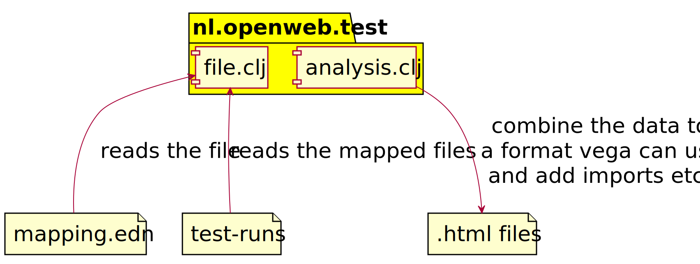

# Apache Kafka with GraphQL examples

This project is all about experimenting with Kafka and GraphQL. The frontend is deployed [here](https://graphql.gklijs.tech/results/linger-ms-config/average-latency) without a working backend but does contain some results from running tests..

[](http://www.youtube.com/watch?v=EN73NiR8xZI "Using Kafka with GraphQL")

[](https://travis-ci.com/openweb-nl/kafka-graphql-examples)

## Summary

It contains a CQRS backend that handles commands from the GraphQL endpoint.
That backend will emit both direct responses to the commands and derived events while processing the commands.
With GraphQL subscriptions these events might be passed to the frontend.
The test module makes it possible to do performance tests and compare multiple implementations and/or configurations.

Contents
* [Intro](#intro)
* [Development](#development)
  * [Building locally](#building-locally)
  * [Building remote](#building-remote)
  * [Building other backend](#other-backend)
* [Modules](#modules)
  * [Topology](#topology)
  * [Synchronizer](#synchronizer)
  * [Command handler](#command-handler)
  * [Graphql endpoint](#graphql-endpoint)
  * [Frontend](#frontend)
  * [Test](#test)
* [Scripts](#scripts)

## <a id="intro">Intro</a>

This project is an example of an event sourcing application using Kafka.
The front-end can be viewed at [kafka-graphql](https://kafka-graphql.gklijs.tech/) which is for now configured to have the endpoint running on localhost.
It also contains an end-to-end test making it possible to compare different implementations or configurations. For example one could set the `linger.ms` setting at different values in the topology module, so everything build on Clojure will use that setting.
It's possible to run tests in travis using the `.travis.yml` file, or on some other machine using the `loop.sh` script. Before you can use the `loop.sh` script you do need to build it first. There is an [open issue](https://github.com/openweb-nl/kafka-graphql-examples/issues/1) to make it easier to run the whole setup locally.

If you don't really know what Kafka is, then it's a good idea to read [an introduction to Kafka](https://hackernoon.com/thorough-introduction-to-apache-kafka-6fbf2989bbc1).
Another good source are the videos from the 2019 Kafka Summit in San Fransisco, especially the [keynotes](https://www.confluent.io/resources/kafka-summit-san-francisco-2019/).
For this project we simulate a bank. The article which served as inspiration for this project is [real-time alerts](https://www.confluent.io/blog/real-time-financial-alerts-rabobank-apache-kafkas-streams-api/).
Currently there are no alerts in the project, these could be added, using browser push notifications for example.

As a general rule it's best to have the same kind of messages on a Kafka cluster.
Data on the brokers is always stored in a binary format, but for clients it's easier to product and consume in something other than binary, therefore there are a lot of (de)serialiser options.
Some of the most common ones are the String(de)serializer and the KafkaAvro(de)serializer.
In this project Strings are used for the keys, and Avro for the values.
You can leave the key empty, but when you supply a key, it can be used to divide a topic among partitions. The default way Kafka partitions messages into partitions is using the hash of the key.
In this project we always use the username a key, which makes sure all the events created by the same user, and also the derived events will end up in the same partition.
This might be used to scale  dynamically, and also makes sure we keep the order of the events relative to the user.
Another way the keys can be used is to 'overwrite' the message with the same key. You can make a compacted topic, where the last message with some key will always be kept.
You can use this with Kafka streams api to generate a 'table' view of a topic.
This could for example be used to keep settings of the user, where instead of all the events we eventually only keep the latest one. 

This project and it's modules are build with [Clojure](https://clojure.org/), and uses [Leiningen](https://leiningen.org/) as build tool.
For building locally sassc is needed, for unix you can see the [travis config](/.travis.yml) or [ask ubuntu answer](https://askubuntu.com/questions/566675/how-to-install-node-sass-gulp-sass-on-ubuntu-14-04-or-linux-mint-17/566681#566681), on Mac with brew you can use `brew install sassc`.
Some modules can be used from java, and some of the code generated (Avro classes) are also java.
Even when using Docker you need to have leiningen and sassc installed to build the project. This might change with [open issue](https://github.com/openweb-nl/kafka-graphql-examples/issues/1).

The base idea of the project is to serve as an example of event sourcing, where instead of having a 'state' as source of truth we use events. It makes use of some of the best practices by using both events which start with 'Confirm', which need to be handled by another component and lead to either a 'Confirmed' or 'Failed' event.
By using id's in the messages, when needed the creator of the 'Confirm' event can eventually know whether the command succeeded.
Sometimes there may be additional information in the confirmed events, failed events typically contain the reason why the command failed. Even trough the 'real' source of truth are events, most component keep some kind of state.
In this particular project almost all state only exists in memory, and even the Kafka containers are not configured to have use data volumes.
Which makes it easy to restart the project, but is not production like. There are other things missing as well, like security, and some components would need additional features to be production ready.

All the used event are versioned using [Avro](https://avro.apache.org/) and the [Schema Registry](https://docs.confluent.io/current/schema-registry/docs/index.html),  which is configured with default settings. This makes sure, when using the Avro (de)serialiser, we can update schema's but only with backwards-compatible ones.
The serializer takes care of converting binary data to/from data in specific records.
Since [an enhancement of the Schema Registry](https://www.confluent.io/blog/put-several-event-types-kafka-topic/) it's possible to keep using the Schema Registry for restricting breaking changes, while still being able to put multiple types of events in one topic.
This is used to put multiple types of events on one topic.
For example all the commands are put on one topic.
By also using the username as the key as mentioned, we are almost sure the order of the commands for each user is kept.

Underneath is a complete overview of all the components.
Where the grey one is the kafka platform, including ZooKeeper and Schema Registry, the green is Nginx and the blue ones are PostgreSQL databases.
The yellow ones are, at least in the master branch, clojure applications.



## <a id="development">Development</a>

Development is done in Clojure with a lot of java integration.
When starting this project there where no great Kafka libraries for Clojure.
Both [jackdaw](https://github.com/FundingCircle/jackdaw) and [noah](https://github.com/blak3mill3r/noah) look promising, and might be a better fit than Java interop, especially when your not yet familiar with Kafka.

This project is only using the producer and consumer to add or consume data from Kafka.
But especially when merging topics it might be easier to use the Kafka Streams api.
With it you can do things like having a time window, or do joins on topics. The mentioned libraries also use Kafka Streams.
This could be relevant when you have an 'AlertsSettingsUpdated' event which must be combined with a 'MightTriggerAlert' event. Because you want to send alerts, using the latest settings available.

### <a id="building-locally">Building locally</a>

There are two out of the box ways to run the project, using the confluent cli, or Docker.
Using docker is a lot easier because the whole setup is scripted. When developing on one of the parts, it's possible to stop the docker of that part and run it locally.
The Docker config has additional listeners to make this easier, see [kafka-listeners-explained](https://rmoff.net/2018/08/02/kafka-listeners-explained/).

#### Using Clojure and confluent cli

This project uses the modules plugin for Leingen. If you have Leingen installed you need to first 'install' topology by doing `lein install` in the topology folder.
If you use [Cursive](https://cursive-ide.com/) you can start each module by going to the main function in `core.clj`, or you can use `lein run` to start. For the Kafka stuff it's handy to use the [confluent cli](https://docs.confluent.io/current/cli/index.html#cli).

With this you can use `confluent destroy` to stop all the processes and `confluent start schema-registry` to start zookeeper, Kafka and the schema registry.
This will use the 'default' ports, which make it possible to run all the modules without having to set environment variables.

In addition to Kafka you also not to run PostgreSQL, you might do this using docker, in which case you can use the `setup-db.sh` script to prepare the database.

#### Using Docker

You will need Leiningen and sassc installed. Then with the `prepare.sh` script all the fat jars and a few other files needed for the Docker images are created. Then with the `restart.sh` script you can use Docker to set it up. You will need about 8Gb of ram for Docker to not run out of memory.

Currently the script works with a sleep, to prevent unnecessary errors from other containers not being ready yet. You can ignore the errors about orphan containers apparently this is a side effect of having multiple Docker compose files in the same folder.
Compose file version 2 is used for multiple reasons, it's easy to set a mem limit, and the names of the containers can be set, which make it easy to measure cpu and memory.

For the Kafka images the latest ones from Confluent are used. For the frontend we use Nginx. Most other containers are just jar's that run inside `azul/zulu-openjdk-alpine` to keep the docker image small.
For the Confluent images there are a lot of options that can be set.
Encryption is enabled, but it's also possible to create acl's for authorization.
Among the other kinds of properties are defaults for creating topics, and configuration of the log cleanup.
The whole list can be found [here](https://kafka.apache.org/documentation/#brokerconfigs).

### <a id="building-remote">Building remote</a>

Make sure sure you are connected to the correct remote Docker machine.
With the build-all.sh script in the root the running containers started with the script will be stopped and deleted. And in three phases the needed containers will be started. The `.dockerignore` files are set to only expose the files needed which should make it pretty fast, still some of the jar's can be quite big.

### <a id="other-backend">Building other backends</a>

It's possible to add the topology dependency to a jvm project by including it in the dependencies, for maven:

```xml    
<dependency>
    <groupId>nl.openweb</groupId>
    <artifactId>topology</artifactId>
    <version>0.1.0-SNAPSHOT</version>
</dependency>
```
You will need to have run `lein install` in the topology folder or have run the `prepare.sh` script to make it work.

This will put the Avro SpecificRecord classes on your classpath, which you need if you want to consume using specific Avro classes instead of getting an generic Avro class.
Specific classes are both easier to use, and are supposed to be faster to serialize.
You can also use these classes to produce. To do this create the correct object as value of in a Kafka ProducerRecord.
For non-jvm languages the support for Avro is often more limited.
For rust to some degree the [schema_registry_converter](https://crates.io/crates/schema_registry_converter) can be used.

If you want to use some of the Clojure functions from java take a look at the last part of [Clojure java interop / calling Clojure from java](https://clojure.org/reference/java_interop).
Most namespaces also have the gen-class attribute, providing a more direct way of calling the functions.

## <a id="modules">Modules</a>

The modules are describe in order of data flow.
The first, topology will be used to generate the data types, the last but one, frontend will expose the data to make it visible.

### <a id="topology">Topology</a>

This module generates the java classes needed to use specific Avro schemas.
This is usually done using a maven plugin, which generates the classes based on .avsc files as is described in the [avro documentation](https://avro.apache.org/docs/1.9.1/gettingstartedjava.html#Compiling+the+schema).

[Spring cloud stream schema](https://github.com/spring-cloud/spring-cloud-stream/tree/master/spring-cloud-stream-schema) also has an option to use Avro, in that case they need to be in the source directory.
The way this integrates with Kafka is however much different from the confluent one, so it is most useful in a spring cloud only environment.



Generating the classes with the maven plugin can be very tedious since there tend to be a lot of repeated elements in schemas.
By doing some replacements on the structure in the schemas.edn a lot of these are prevented.
For always setting the namespace of the records to 'nl.openweb.data'.
This also allows to have a method, which only needs the names, to get the parsed schema from the generated classes.

The module also provides some convenient functions to consume from and produce to Kafka for the use of Kafka with Clojure. For other languages there are probably better options.

There are also some functions to deal with specific data types like 'IBAN' and 'UUID'.

Finally there are functions describing the topics.
The [topology.edn](topology/resources/topology.edn) file in the resource folder gives information about the topics, for example:

```clojure
 "commands"  [24 3 [:ConfirmAccountCreation :ConfirmMoneyTransfer] {:retention.ms -1}]
```

The first part is the actual name of the Kafka topic, and in this particular case also serves as the key as part of a map. From the vector, which is the value, we can read that it had `9` partitions `3` replicas, is bound to the `ConfirmAccountCreation` and `ConfirmMoneyTransfer` Avro types (which can be found in the [schemas.edn](topology/resources/schemas.edn)), has additional configuration to prevent the events from being deleted from kafka.

To be able to use new schemas changes are needed the `topology.edn` and `schemas.edn`, a `lein deploy` of the code needs to be done (maybe with a new version), and the Synchronizer needs to run with the new artifacts
Clients using the new dependency are now able to produce/consume the new schema from the configured topics.

### <a id="synchronizer">Synchronizer</a>

This module is used to synchronize an actual cluster with the configuration found in the topology module.
So when a topic does not exist yet, it creates it, and when there is a topic which is not present in the topology it will be deleted.
It will also try to set the schemas for the topics, when there is a schema name provided.
When creating topics it will try to set the replication factor to the requested value, but never higher the the amount of brokers available.
When a configuration is provided, it will be used when creating the topics. 



There are some limitations in the current implementation:
- When the topic already exist, and also should exist, the configuration of the topic is not checked.
- It's not possible to use any of the new ways to configure the schema registry, it's always assuming the 'TopicNameStrategy', see [group by topic or other relationships](https://docs.confluent.io/current/schema-registry/serializer-formatter.html#group-by-topic-or-other-relationships).
- Errors are not handled (e.g. no retry), but the responses from setting the schemas can be read, and the exit status is only 0 when it's gone ok.

### <a id="command-handler">Command handler</a>

In order to validate the commands the command handler will do queries on postgres to know whether the message was already handled.
It will do inserts and updates to transfer money and open accounts.
When a `ConfirmAccountCreation` is received this will this will almost always generate an `AccountCreationConfirmed` containing the generated token and iban.
Only when an existing iban is generated an `AccountCreationFailed` is generated.
When a `ConfirmMoneyTransfer` is received there are multiple reason it might fail.
The token might be wrong, there me be insufficient funds, or the from and to have the same value. This will trigger a `MoneyTransferFailed` event with the reason. When the transfer succeeds the `MoneyTransferConfirmed` will be returned, containing only the uuid of the command.
For each changed account a `BalanceChanged` event is returned.
For each of these events as a key the useername will be used.



### <a id="graphql-endpoint">Graphql endpoint</a>

This graphql endpoint is by example build using [Stuart Sierra Component Library](https://github.com/stuartsierra/component). This helps keeping dependencies transparent, and also makes it easier for testing/mocking part of the system.
With [system-viz](https://github.com/walmartlabs/system-viz) we can also easily create an overview of the system: .
To create a new overview use `lein with-profile viz run` in the `graphql-endpoint` folder.

Since this component is quit complicated there are views of each service separately.


Transaction service is used to either do a query on the current transactions in the db, or start a subscription using a selection of filters to get new transactions when they are consumed.


Account creation can be used to create a account and gives feedback, for example when the password is incorrect.


These is the flow of opening an account.


Money transfer service can be used to transfer money, and gives feedback, for example when the token is wrong.


These is the flow of transferring money.

This endpoint allows querying/streaming `BalanceChanged` events, creating an account/iban and making a transaction, by a streams witch will give feedback whether the action succeeded. It's possible to get a subscription with optional filters.
It's also possible to get all transactions from some iban, or the last transactions.
The documented graphiql endpoint with can be found [here](http://localhost:8888) when running locally.
The endpoint is created using [lacinia](http://lacinia.readthedocs.io/en/latest/overview.html) together with [lacinia-pedestal](http://lacinia-pedestal.readthedocs.io/en/latest/overview.html).

### <a id="frontend">Front-end</a>

This is a basic nginx container which contains the output from the Clojurescript re-frame code. The container is exposed at port 8181.
The location of the GraphQL endpoint is configured in [core.cljs](frontend/src/cljs/nl/openweb/bank/core.cljs) this is configured to use localhost.
Nginx now just serves static files, but could be used to proxy traffic to the graphql endpoint to prevent CORS.
If you run into CORS trouble localy you may need to add the specific port you use to run the front-end to the [server.clj](graphql-endpoint/src/nl/openweb/graphql_endpoint/server.clj) in the endpoint at the `:io.pedestal.http/allowed-origins` key.

### <a id="test">Test</a>

This module contains the code both to run tests and to generate multiple html files from one or multiple run tests.
Each run tests will write a .edn file in the resources folder. The name is a combination of the `base-file-name` in [file.clj](test/src/nl/openweb/test/file.clj) and the year, month, day, hour and minute the test is started.
A mapping can be edited in the [mapping.edn](resources/linger-ms-config.edn) file. You can combine several files if they start the same by adding a '\*', for example 'clojure-\*' will combine all the test run files starting with 'clojure-'.
A test will start by making some connections and waiting till the user is logged in. When this happens the client will have received and Iban and the matching token in order to transfer money.
It will run depending on some settings in [core.clj](test/src/nl/openweb/test/core.clj). It will run till `max-time-outs` occur, where a time-out is when the response takes longer then `max-interaction-time` ms. The `batch-cycle` determines after how many cycles the load is increases.
The `loops-for-success` determines the exit code, and with it a successful run for travis.



To display the test runs the files are combined and sorted on additional-load, the averages and standard error are also calculated.



It's the easiest to run the tests and generate the output with the scripts using the fat jar. But you could also run them directly using lein, but some of the paths need to be changed to do so. 

## <a id="scripts">Scripts</a>

There are several scripts to automate things. They are placed at the root level.
* `clean.sh` stops and removes all used Docker container, it does not throw away the images
* `create-certs.sh` is used to create a docker volume with the needed certs/secrets.
* `loop.sh` takes a number and a test configuration and will (re)create the whole environment, and run a test, using the said configuration x times.
* `prepare.sh` is needed the first time before `restart.sh` can be used. It will get all the dependencies and build jar's. It needs leiningen, maven, sassc to be installed. As last step it will (re)build the docker images.
* `restart.sh` is used to stop and start the whole setup, it does not start a test. When it's finished the application should be accessible at port 8181. 
* `setup-db-ch.sh` and `setup-db-ge.sh` are used to setup the database. It takes the name of the Docker container to execute it on as the first argument and the port used as the second. When running a local PostgreSQL you could copy parts of it to create the users, tables and indexes.
* `synchronize.sh` is used as part of the restart to set both the Kafka topics and schema's in the schema registry.
* `create-data-json.sh` needs a name argument, matching a .edn file in resources with a mapping. It will process the data so it can be used by vega in the frontend.
